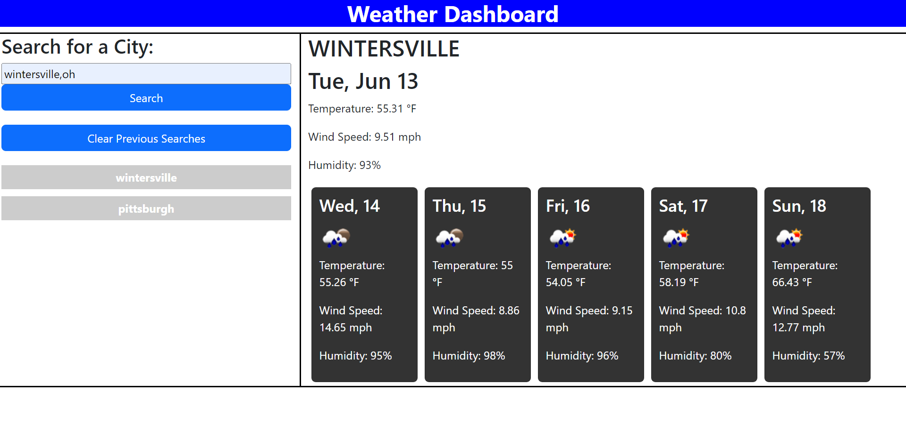

# weather-api-demo
application that takes user desired city name and displays the 5-day weather data from the open weather api

## how to use
type in the city and state abbreviation like this 'pittsburgh,pa' and click 'Search'. To clear previous searches you can click that button

## where to find
view the github page here: https://mckit77.github.io/weather-api-demo/

view the github repo here: https://github.com/MCKIT77/weather-api-demo

